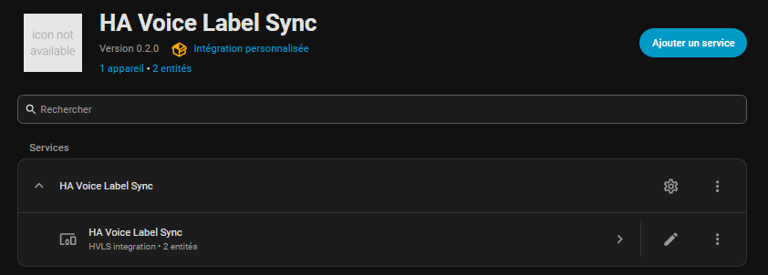
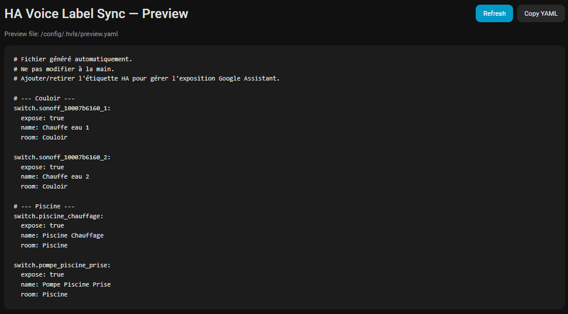
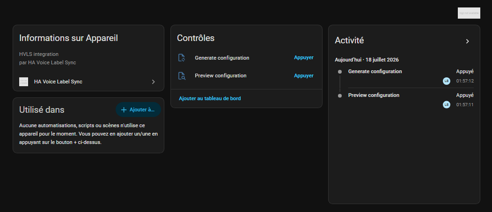

# HA Voice Label Sync

> **Manage once in Home Assistant. Sync everywhere.**

Automatically generate voice assistant configurations from **Home Assistant labels**.

HVLS turns Home Assistant labels into the single source of truth for exposing entities to your voice assistants. Preview the generated configuration, verify it, then generate it safely.

---

## ✨ Why HA Voice Label Sync?

Managing large `entity_config` files manually quickly becomes tedious and error-prone.

HA Voice Label Sync lets you manage everything directly from Home Assistant:

- 🏷️ Choose which entities to expose using labels
- 👀 Preview the generated configuration before writing anything
- 💾 Create automatic backups
- 🏠 Integrate natively with Home Assistant
- ⚡ Generate configuration in seconds
- 🔌 Designed to support multiple voice assistants

---

## 📸 Screenshots

> *(Screenshots will be updated with the latest UI.)*

- Home Assistant Configuration

- Preview Panel

- Generated YAML

- Google Home synchronization

---

## 🚀 Typical workflow

```text
Home Assistant
      │
      ▼
Assign a Label
      │
      ▼
Click Preview
      │
      ▼
Review Generated YAML
      │
      ▼
Click Generate
      │
      ▼
Restart Home Assistant
      │
      ▼
Synchronize Voice Assistant
```

---

# Features

## 🏠 Home Assistant Integration

- Native Config Flow
- Options Flow
- Preview Panel
- Generate action
- Preview action
- Automatic backups
- Secure WebSocket API
- English & French translations

---

## 🐍 Python Engine

- Reusable Python package
- Standalone CLI
- Atomic file generation
- Dry-run support
- Automatic backup retention
- Backend-independent architecture

---

## 🎤 Supported Voice Assistants

| Backend | Status |
|----------|--------|
| Google Assistant | ✅ Supported |
| Amazon Alexa | 🚧 Planned |
| Apple HomeKit | 📋 Planned |

---

# Architecture

```text
                Home Assistant
                       │
                       ▼
                    Labels
                       │
                       ▼
             HA Voice Label Sync
                       │
         ┌─────────────┴─────────────┐
         │                           │
         ▼                           ▼
 Google Assistant           Future Backends
                               • Alexa
                               • HomeKit
```

---

# Installation

## Home Assistant (HACS)

🚧 Coming soon.

---

## Home Assistant (Manual)

Documentation coming soon.

---

## Python package

```bash
pip install ha-voice-label-sync
```

---

# Quick Start

1. Create a label in Home Assistant.
2. Assign this label to the entities you want to expose.
3. Configure the integration.
4. Click **Preview**.
5. Review the generated configuration.
6. Click **Generate**.
7. Restart Home Assistant.
8. Synchronize your voice assistant.

---

# CLI

HVLS also provides a standalone CLI for advanced users and automation.

```bash
hvls --help
```

---

# Documentation

Additional documentation will be available in the `docs/` directory.

---

# Roadmap

See **[ROADMAP.md](ROADMAP.md)**.

---

# Contributing

Contributions are welcome!

Bug reports, feature requests and pull requests help improve the project.

If you have ideas, don't hesitate to open an issue or start a discussion.

---

# License

MIT
